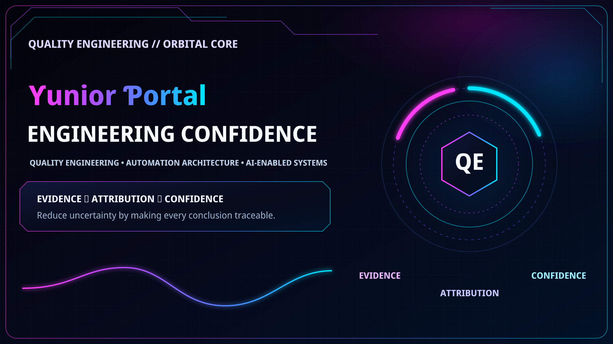
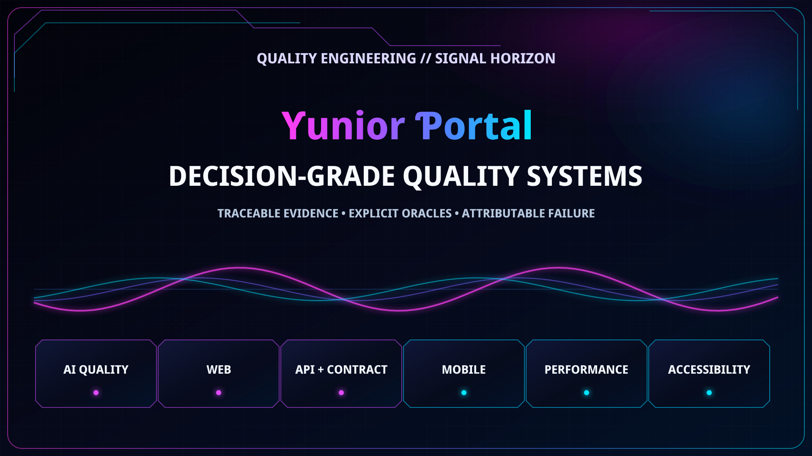
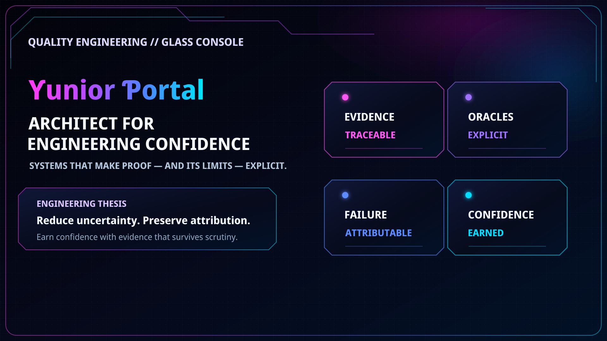
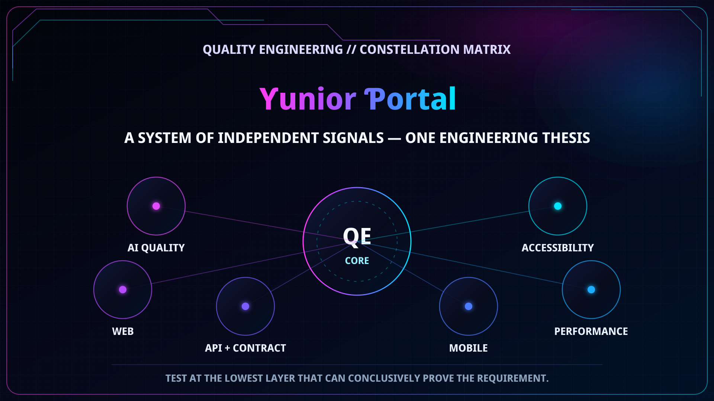
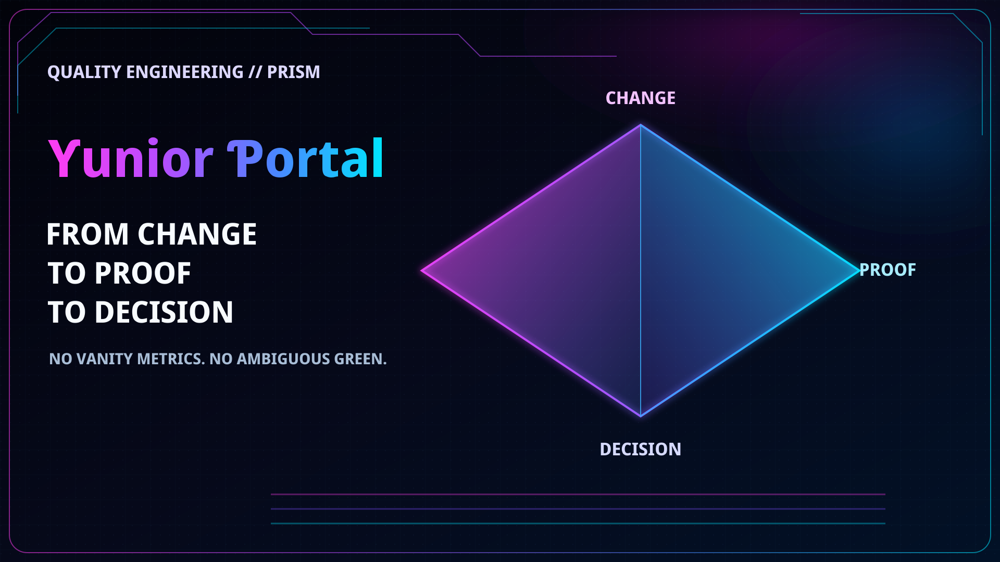
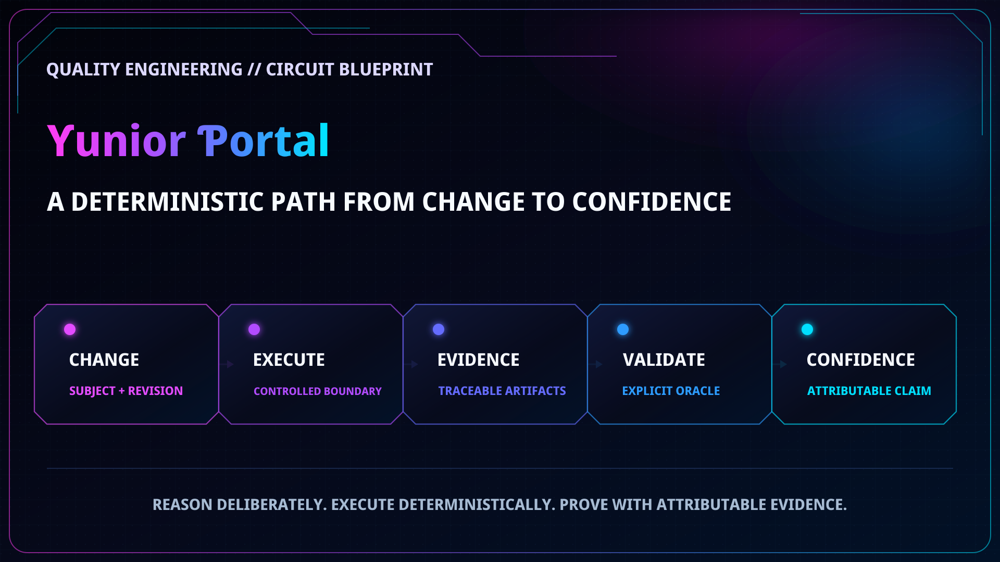

# FHD Profile SVG Concepts — Outlined Typography Review

This pull request is a **design review only**. It does not add any SVG to the live profile `README.md`.

The six concepts below were rebuilt from scratch at **true FHD 1920 × 1080 (16:9)**. Every visible word is converted to SVG vector paths before it enters the composition, so GitHub/browser font substitution cannot change glyph width, kerning, line breaks, or container fit.

## Production contract

- Exact canvas: `1920 × 1080`
- Exact `viewBox="0 0 1920 1080"`
- `preserveAspectRatio="xMidYMid meet"`
- No visible `<text>` elements
- Typography is path-outlined vector geometry
- No embedded raster `<image>` elements
- No `<script>`, `<foreignObject>`, remote fonts, or external visual assets
- Pure SVG/vector artwork only
- Each exact SVG is generated deterministically and validated against the same FHD contract
- Live profile remains unchanged until one direction is selected

---

## 1 — Orbital Core

A cinematic Quality Engineering command center with a dedicated proof reactor. Best fit if the goal is to preserve the neon/HUD identity while keeping the copy large and spatially isolated.

**Visual thesis:** Evidence → Attribution → Confidence  
**Character:** cinematic · technical · signature identity  
**Best for:** strongest continuation of the existing portfolio visual brand

---

## 2 — Signal Horizon

A wide signal-wave composition with six large domain modules and no compact dashboard copy. This is designed to remain immediately readable when GitHub scales the FHD source down.

**Visual thesis:** Traceable evidence · explicit oracles · attributable failure  
**Character:** modern · spacious · readable  
**Best for:** maximum legibility without losing the neon engineering aesthetic

---

## 3 — Glass Console

An executive systems-architecture direction. Four large doctrine panels frame Evidence, Oracles, Failure, and Confidence as independent engineering contracts.

**Visual thesis:** make both proof and its limits explicit  
**Character:** architectural · premium · Principal/Staff-level  
**Best for:** sophisticated engineering-leadership positioning

---

## 4 — Constellation Matrix

A systems topology rather than a badge/icon wall. Independent quality domains connect to a central QE core while remaining visually separable.

**Visual thesis:** independent signals, one engineering thesis  
**Character:** systems-thinking · portfolio architecture · networked  
**Best for:** communicating breadth without presenting a tool catalog

---

## 5 — Prism Minimal

The most minimal option. A large geometric prism turns **Change → Proof → Decision** into the dominant visual metaphor.

**Visual thesis:** transform change into decision-grade proof  
**Character:** premium · minimal · distinctive  
**Best for:** avoiding the typical GitHub dashboard aesthetic entirely

---

## 6 — Circuit Blueprint

A deterministic engineering pipeline from Change through Controlled Execution, Evidence, Validation, and Confidence.

**Visual thesis:** confidence is the output of an attributable control path  
**Character:** explicit · architectural · engineering-first  
**Best for:** making the Quality Engineering operating model immediately understandable

---

## Selection

This PR should **not** be merged as the final implementation. Choose one direction—or a deliberate combination of two—and the selected concept will be refined in a separate implementation PR before anything changes on the live profile.
