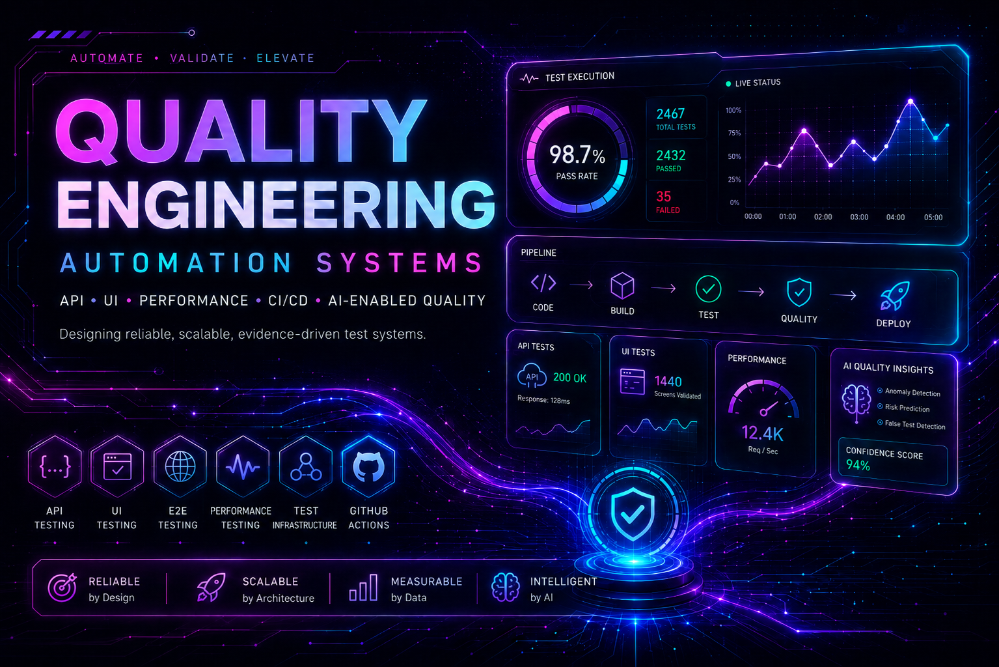

<strong>I engineer quality systems that turn software change into attributable evidence — and evidence into decision-grade confidence.</strong>

 

  

<h3 align="center"><big>◈&nbsp;&nbsp;QE Domains</big></h3>

<picture><source media="(min-width: 641px)" srcset="https://img.shields.io/badge/-AI--Enabled%20QE-FF2BD6?style=flat-square" width="91" height="24"></picture> <picture><source media="(min-width: 641px)" srcset="https://img.shields.io/badge/-Web%20%2F%20UI-7A5CFF?style=flat-square" width="59" height="24"></picture> <picture><source media="(min-width: 641px)" srcset="https://img.shields.io/badge/-API-00AEEF?style=flat-square" width="29" height="24"></picture> <picture><source media="(min-width: 641px)" srcset="https://img.shields.io/badge/-GraphQL-E10098?style=flat-square" width="59" height="24"></picture> <picture><source media="(min-width: 641px)" srcset="https://img.shields.io/badge/-Mobile-00BFA6?style=flat-square" width="45" height="24"></picture> <picture><source media="(min-width: 641px)" srcset="https://img.shields.io/badge/-CI%2FCD-665CFF?style=flat-square" width="43" height="24"></picture>

<h3 align="center"><big>▦&nbsp;&nbsp;Test Architecture</big></h3>

<picture><source media="(min-width: 641px)" srcset="https://img.shields.io/badge/-Unit-16A34A?style=flat" width="33" height="24"></picture> <picture><source media="(min-width: 641px)" srcset="https://img.shields.io/badge/-Component-00A6C7?style=flat" width="73" height="24"></picture> <picture><source media="(min-width: 641px)" srcset="https://img.shields.io/badge/-Integration-7F5AF0?style=flat" width="71" height="24"></picture> <picture><source media="(min-width: 641px)" srcset="https://img.shields.io/badge/-Contract-FF3CAC?style=flat" width="57" height="24"></picture> <picture><source media="(min-width: 641px)" srcset="https://img.shields.io/badge/-E2E-008CFF?style=flat" width="31" height="24"></picture> <picture><source media="(min-width: 641px)" srcset="https://img.shields.io/badge/-Database%20%2F%20Persistence-0D9488?style=flat" width="137" height="24"></picture> <picture><source media="(min-width: 641px)" srcset="https://img.shields.io/badge/-Visual%20Regression-A020F0?style=flat" width="107" height="24"></picture> <picture><source media="(min-width: 641px)" srcset="https://img.shields.io/badge/-Accessibility-EA580C?style=flat" width="77" height="24"></picture> <picture><source media="(min-width: 641px)" srcset="https://img.shields.io/badge/-Security-EA2B2B?style=flat" width="55" height="24"></picture> <picture><source media="(min-width: 641px)" srcset="https://img.shields.io/badge/-Performance-6FAF00?style=flat" width="79" height="24"></picture>

Designed for Reproducibility · Attribution · Evidence-backed Decisions

---

## ✦ Engineering Thesis

<table>
<tr>
<td>
Quality engineering is the discipline of <strong>reducing uncertainty about change</strong>. I design systems that collect evidence at the narrowest conclusive layer, separate reasoning from authority, and preserve the limits of every oracle. A green state should explain exactly <strong>what was proven, by which evidence, against which subject, and under which execution boundary</strong>.
</td>
</tr>
</table>

<strong><em>Reason deliberately. Execute deterministically. Prove with attributable evidence.</em></strong>

 

<table width="100%">
<thead>
<tr>
<th width="37%" align="center"><picture><source media="(min-width: 641px) and (max-width: 1024px) and (orientation: landscape) and (prefers-color-scheme: dark)" srcset="https://raw.githubusercontent.com/portyu9/portyu9/44471c9ba38958e601bc602557dfa0642633f897/assets/profile-badges/thesis-header-principle-mobile-dark.svg"><source media="(min-width: 641px) and (max-width: 1024px) and (orientation: landscape)" srcset="https://raw.githubusercontent.com/portyu9/portyu9/44471c9ba38958e601bc602557dfa0642633f897/assets/profile-badges/thesis-header-principle-mobile-light.svg"><source media="(min-width: 641px) and (prefers-color-scheme: dark)" srcset="https://raw.githubusercontent.com/portyu9/portyu9/44471c9ba38958e601bc602557dfa0642633f897/assets/profile-badges/thesis-header-principle-desktop-dark.svg"><source media="(min-width: 641px)" srcset="https://raw.githubusercontent.com/portyu9/portyu9/44471c9ba38958e601bc602557dfa0642633f897/assets/profile-badges/thesis-header-principle-desktop-light.svg"><source media="(prefers-color-scheme: dark)" srcset="https://raw.githubusercontent.com/portyu9/portyu9/44471c9ba38958e601bc602557dfa0642633f897/assets/profile-badges/thesis-header-principle-mobile-dark.svg"></picture></th>
<th width="63%" align="center"><picture><source media="(min-width: 641px) and (max-width: 1024px) and (orientation: landscape) and (prefers-color-scheme: dark)" srcset="https://raw.githubusercontent.com/portyu9/portyu9/44471c9ba38958e601bc602557dfa0642633f897/assets/profile-badges/thesis-header-engineering-contract-mobile-dark.svg"><source media="(min-width: 641px) and (max-width: 1024px) and (orientation: landscape)" srcset="https://raw.githubusercontent.com/portyu9/portyu9/44471c9ba38958e601bc602557dfa0642633f897/assets/profile-badges/thesis-header-engineering-contract-mobile-light.svg"><source media="(min-width: 641px) and (prefers-color-scheme: dark)" srcset="https://raw.githubusercontent.com/portyu9/portyu9/44471c9ba38958e601bc602557dfa0642633f897/assets/profile-badges/thesis-header-engineering-contract-desktop-dark.svg"><source media="(min-width: 641px)" srcset="https://raw.githubusercontent.com/portyu9/portyu9/44471c9ba38958e601bc602557dfa0642633f897/assets/profile-badges/thesis-header-engineering-contract-desktop-light.svg"><source media="(prefers-color-scheme: dark)" srcset="https://raw.githubusercontent.com/portyu9/portyu9/44471c9ba38958e601bc602557dfa0642633f897/assets/profile-badges/thesis-header-engineering-contract-mobile-dark.svg"></picture></th>
</tr>
</thead>
<tbody>
<tr>
<td align="center"></td>
<td>A conclusion should be traceable to the exact subject, revision, environment, execution, oracle, and artifacts that support it.</td>
</tr>
<tr>
<td align="center"></td>
<td>AI may interpret, diagnose, rank risk, and propose; deterministic policy and validation retain authority over side effects and terminal truth.</td>
</tr>
<tr>
<td align="center"></td>
<td>Keep failure domains separable so a broken schema, resolver, transport, browser state, device session, threshold, baseline, dependency, or environment produces the right signal.</td>
</tr>
<tr>
<td align="center"></td>
<td>Every oracle has a scope and a limit. A green visual diff, accessibility scan, contract check, or CI job may claim only what its evidence can actually establish.</td>
</tr>
<tr>
<td align="center"></td>
<td>CI should qualify explicit runtime, dependency, target, security, and evidence contracts; a green workflow should claim no more than those signals prove.</td>
</tr>
<tr>
<td align="center"></td>
<td>Mutation, external integration, sustained load, secrets, and other high-impact capabilities belong behind explicit ownership, authorization, budgets, and fail-closed boundaries.</td>
</tr>
</tbody>
</table>

---

#### Confidence is not proportional to automation volume.  
#### It is earned when evidence is traceable, oracles are explicit, and failure is attributable.

---

<h2 align="center">◉ Activity Metrics</h2>

<picture>
  <source media="(max-width: 640px) and (prefers-color-scheme: dark)" srcset="https://raw.githubusercontent.com/portyu9/portyu9/generated/profile-stats/profile/signal-field-compact-dark.svg?v=signal-field-monday-context-20260903">
  <source media="(max-width: 640px)" srcset="https://raw.githubusercontent.com/portyu9/portyu9/generated/profile-stats/profile/signal-field-compact-light.svg?v=signal-field-monday-context-20260903">
  <source media="(prefers-color-scheme: dark)" srcset="https://raw.githubusercontent.com/portyu9/portyu9/generated/profile-stats/profile/signal-field-wide-dark.svg?v=signal-field-monday-context-20260903">
  
</picture>

