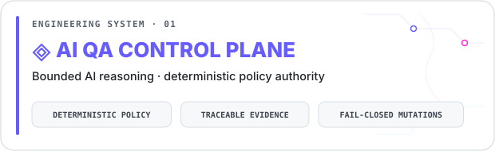
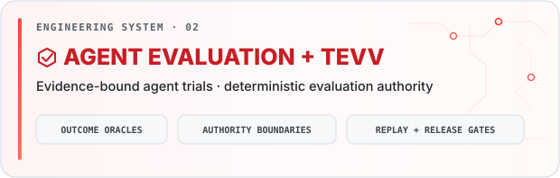
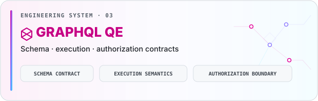
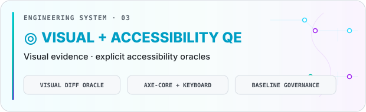

<picture></picture>

<strong>I engineer quality systems that turn software change into attributable evidence — and evidence into bounded, decision-grade confidence.</strong>

 

<picture></picture> <picture></picture> <picture></picture>

<strong>Review paths</strong> · <a href="https://github.com/portyu9/ai-qa-automation">AI QA Control Plane</a> · <a href="https://github.com/portyu9/qa-automation-ai-agent-evals">Agent Evaluation / TEVV</a> · <a href="https://github.com/portyu9?tab=repositories">QE Systems Portfolio</a>

<h2 align="center">◈&nbsp;&nbsp;QE Domains</h2>

<a href="https://github.com/portyu9/ai-qa-automation"><picture><source media="(min-width: 641px)" srcset="https://img.shields.io/badge/-AI--Enabled%20QE-FF2BD6?style=flat-square" width="110" height="29"></picture></a> <a href="https://github.com/portyu9/qa-automation-ai-agent-evals"><picture><source media="(min-width: 641px)" srcset="https://img.shields.io/badge/-Agent%20Evaluation%20%2F%20TEVV-9C4DFF?style=flat-square" width="175" height="29"></picture></a> <a href="https://github.com/portyu9/qa-automation-dotnet-selenium"><picture><source media="(min-width: 641px)" srcset="https://img.shields.io/badge/-Web%20%2F%20UI-7A5CFF?style=flat-square" width="71" height="29"></picture></a> <a href="https://github.com/portyu9/qa-automation-api-postman-newman"><picture><source media="(min-width: 641px)" srcset="https://img.shields.io/badge/-API-00AEEF?style=flat-square" width="35" height="29"></picture></a> <a href="https://github.com/portyu9/qa-automation-graphql"><picture><source media="(min-width: 641px)" srcset="https://img.shields.io/badge/-GraphQL-E10098?style=flat-square" width="71" height="29"></picture></a> <a href="https://github.com/portyu9/qa-automation-mobile-appium"><picture><source media="(min-width: 641px)" srcset="https://img.shields.io/badge/-Mobile-00BFA6?style=flat-square" width="54" height="29"></picture></a> <a href="https://github.com/portyu9/qa-automation-ui-cypress"><picture><source media="(min-width: 641px)" srcset="https://img.shields.io/badge/-CI%2FCD-665CFF?style=flat-square" width="52" height="29"></picture></a>

<h2 align="center">▦&nbsp;&nbsp;Test Architecture</h2>

<a href="https://github.com/portyu9/qa-automation-python-pytest"><picture><source media="(min-width: 641px)" srcset="https://img.shields.io/badge/-Unit-16A34A?style=flat" width="40" height="29"></picture></a> <a href="https://github.com/portyu9/qa-automation-node-supertest"><picture><source media="(min-width: 641px)" srcset="https://img.shields.io/badge/-Component-00A6C7?style=flat" width="88" height="29"></picture></a> <a href="https://github.com/portyu9/qa-automation-java-restassured"><picture><source media="(min-width: 641px)" srcset="https://img.shields.io/badge/-Integration-7F5AF0?style=flat" width="86" height="29"></picture></a> <a href="https://github.com/portyu9/qa-automation-node-supertest"><picture><source media="(min-width: 641px)" srcset="https://img.shields.io/badge/-Contract-FF3CAC?style=flat" width="69" height="29"></picture></a> <a href="https://github.com/portyu9/qa-automation-node-playwright"><picture><source media="(min-width: 641px)" srcset="https://img.shields.io/badge/-E2E-008CFF?style=flat" width="37" height="29"></picture></a> <a href="https://github.com/portyu9/qa-automation-python-pytest"><picture><source media="(min-width: 641px)" srcset="https://img.shields.io/badge/-Database%20%2F%20Persistence-0D9488?style=flat" width="166" height="29"></picture></a> <a href="https://github.com/portyu9/qa-automation-visual-and-accessibility-playwright-axe"><picture><source media="(min-width: 641px)" srcset="https://img.shields.io/badge/-Visual%20Regression-A020F0?style=flat" width="129" height="29"></picture></a> <a href="https://github.com/portyu9/qa-automation-visual-and-accessibility-playwright-axe"><picture><source media="(min-width: 641px)" srcset="https://img.shields.io/badge/-Accessibility-EA580C?style=flat" width="93" height="29"></picture></a> <a href="https://github.com/portyu9/ai-qa-automation"><picture><source media="(min-width: 641px)" srcset="https://img.shields.io/badge/-Security-EA2B2B?style=flat" width="66" height="29"></picture></a> <a href="https://github.com/portyu9/qa-automation-load-k6"><picture><source media="(min-width: 641px)" srcset="https://img.shields.io/badge/-Performance-6FAF00?style=flat" width="95" height="29"></picture></a>

<big>Designed for Reproducibility · Attribution · Evidence-backed Decisions</big>

---

<h2 align="center">✦ Engineering Thesis</h2>

<table>
<tr>
<td>
I treat quality engineering as the discipline of <strong>reducing uncertainty about change</strong>. I design systems that collect evidence at the narrowest layer sufficient to support a conclusion, separate reasoning from authority, and preserve the scope and limits of every oracle. A green state should make explicit <strong>what the evidence establishes, for which subject and revision, in which environment, through which oracle, and under which execution boundary</strong>.
</td>
</tr>
</table>

<strong><em>Reason deliberately. Execute deterministically. Prove with attributable evidence.</em></strong>

 

<table width="100%">
<thead>
<tr>
<th width="37%" align="center"><picture><source media="(min-width: 641px) and (max-width: 1024px) and (orientation: landscape) and (prefers-color-scheme: dark)" srcset="https://raw.githubusercontent.com/portyu9/portyu9/4c6b83d2b1d04c9735c14492da3e0a03f0bb4ce7/assets/profile-badges/thesis-header-principle-mobile-dark.svg"><source media="(min-width: 641px) and (max-width: 1024px) and (orientation: landscape)" srcset="https://raw.githubusercontent.com/portyu9/portyu9/4c6b83d2b1d04c9735c14492da3e0a03f0bb4ce7/assets/profile-badges/thesis-header-principle-mobile-light.svg"><source media="(min-width: 1025px) and (prefers-color-scheme: dark)" srcset="https://raw.githubusercontent.com/portyu9/portyu9/4c6b83d2b1d04c9735c14492da3e0a03f0bb4ce7/assets/profile-badges/thesis-header-principle-desktop-dark.svg"><source media="(min-width: 1025px)" srcset="https://raw.githubusercontent.com/portyu9/portyu9/4c6b83d2b1d04c9735c14492da3e0a03f0bb4ce7/assets/profile-badges/thesis-header-principle-desktop-light.svg"><source media="(prefers-color-scheme: dark)" srcset="https://raw.githubusercontent.com/portyu9/portyu9/4c6b83d2b1d04c9735c14492da3e0a03f0bb4ce7/assets/profile-badges/thesis-header-principle-mobile-dark.svg"></picture></th>
<th width="63%" align="center"><picture><source media="(min-width: 641px) and (max-width: 1024px) and (orientation: landscape) and (prefers-color-scheme: dark)" srcset="https://raw.githubusercontent.com/portyu9/portyu9/4c6b83d2b1d04c9735c14492da3e0a03f0bb4ce7/assets/profile-badges/thesis-header-engineering-contract-mobile-dark.svg"><source media="(min-width: 641px) and (max-width: 1024px) and (orientation: landscape)" srcset="https://raw.githubusercontent.com/portyu9/portyu9/4c6b83d2b1d04c9735c14492da3e0a03f0bb4ce7/assets/profile-badges/thesis-header-engineering-contract-mobile-light.svg"><source media="(min-width: 1025px) and (prefers-color-scheme: dark)" srcset="https://raw.githubusercontent.com/portyu9/portyu9/4c6b83d2b1d04c9735c14492da3e0a03f0bb4ce7/assets/profile-badges/thesis-header-engineering-contract-desktop-dark.svg"><source media="(min-width: 1025px)" srcset="https://raw.githubusercontent.com/portyu9/portyu9/4c6b83d2b1d04c9735c14492da3e0a03f0bb4ce7/assets/profile-badges/thesis-header-engineering-contract-desktop-light.svg"><source media="(prefers-color-scheme: dark)" srcset="https://raw.githubusercontent.com/portyu9/portyu9/4c6b83d2b1d04c9735c14492da3e0a03f0bb4ce7/assets/profile-badges/thesis-header-engineering-contract-mobile-dark.svg"></picture></th>
</tr>
</thead>
<tbody>
<tr>
<td align="center"><picture><source media="(min-width: 1025px)" srcset="assets/profile-badges/principle-evidence-confidence-desktop.svg" width="170" height="79"></picture></td>
<td>A conclusion should be traceable to the exact subject, revision, environment, execution, oracle, and artifacts that support it.</td>
</tr>
<tr>
<td align="center"><picture><source media="(min-width: 1025px)" srcset="assets/profile-badges/principle-reasoning-authorization-desktop.svg" width="187" height="79"></picture></td>
<td>AI may interpret, diagnose, rank risk, and propose; deterministic policy and validation retain authority over side effects and terminal pass/fail state.</td>
</tr>
<tr>
<td align="center"><picture><source media="(min-width: 1025px)" srcset="assets/profile-badges/principle-attribution-abstraction-desktop.svg" width="173" height="79"></picture></td>
<td>Keep failure domains separable so a broken schema, resolver, transport, browser state, device session, threshold, baseline, dependency, or environment produces the right signal.</td>
</tr>
<tr>
<td align="center"><picture><source media="(min-width: 1025px)" srcset="assets/profile-badges/principle-oracle-discipline-desktop.svg" width="171" height="39"></picture></td>
<td>Every oracle has a scope and a limit. A green visual diff, accessibility scan, contract check, or CI job may claim only what its evidence can actually establish.</td>
</tr>
<tr>
<td align="center"><picture><source media="(min-width: 1025px)" srcset="assets/profile-badges/principle-reproducibility-optics-desktop.svg" width="166" height="79"></picture></td>
<td>CI should make runtime, dependency, target, security, and evidence contracts explicit and verifiable; a green workflow should claim no more than those signals establish.</td>
</tr>
<tr>
<td align="center"><picture><source media="(min-width: 1025px)" srcset="assets/profile-badges/principle-safety-architecture-desktop.svg" width="152" height="79"></picture></td>
<td>Mutation, external integration, sustained load, secrets, and other high-impact capabilities belong behind explicit ownership, authorization, budgets, and fail-closed boundaries.</td>
</tr>
</tbody>
</table>

---

#### Confidence does not scale with automation volume alone.  
#### It is earned when evidence is traceable, oracles are explicit, and failure is attributable.

---

<h2 align="center">◇ Selected Engineering Systems</h2>

Four flagship systems · scoped live <code>main</code>-branch evidence

<strong>Evidence review</strong> · <a href="https://github.com/portyu9/portyu9/blob/generated/portfolio-evidence/portfolio-evidence-ledger.json">Portfolio Evidence Ledger</a> · <a href="https://github.com/portyu9/portyu9/blob/main/.github/ATTESTATION.md">Attestation Contract</a>

<a href="https://github.com/portyu9/ai-qa-automation"><picture><source media="(prefers-color-scheme: dark)" srcset="assets/profile-systems/qualification-ai-qa-control-plane-dark.svg"></picture></a> 

<a href="https://github.com/portyu9/qa-automation-ai-agent-evals"><picture><source media="(prefers-color-scheme: dark)" srcset="assets/profile-systems/qualification-agent-evaluation-tevv-dark.svg"></picture></a> 

<a href="https://github.com/portyu9/qa-automation-graphql"><picture><source media="(prefers-color-scheme: dark)" srcset="assets/profile-systems/qualification-graphql-qe-dark.svg"></picture></a> 
&nbsp;

<a href="https://github.com/portyu9/qa-automation-visual-and-accessibility-playwright-axe"><picture><source media="(prefers-color-scheme: dark)" srcset="assets/profile-systems/qualification-visual-accessibility-qe-dark.svg"></picture></a> 
&nbsp;

Workflow badges are scoped <code>main</code>-branch evidence signals, not universal certification.

<h3 align="center">↻ Evidence Spotlight</h3>

3 systems · deterministic daily rotation · scoped live <code>main</code>-branch evidence

<!-- spotlight-direct-links:start -->

<a href="https://github.com/portyu9/qa-automation-java-restassured"><picture><source media="(prefers-color-scheme: dark)" srcset="https://raw.githubusercontent.com/portyu9/portyu9/f638ef5ef7384d25acc967ac3b3ded2081d825df/engineering-spotlight/spotlight-1-dark.svg"></picture></a> 
&nbsp;

<a href="https://github.com/portyu9/qa-automation-python-pytest"><picture><source media="(prefers-color-scheme: dark)" srcset="https://raw.githubusercontent.com/portyu9/portyu9/f638ef5ef7384d25acc967ac3b3ded2081d825df/engineering-spotlight/spotlight-2-dark.svg"></picture></a> 
&nbsp;

<a href="https://github.com/portyu9/qa-automation-ui-cypress"><picture><source media="(prefers-color-scheme: dark)" srcset="https://raw.githubusercontent.com/portyu9/portyu9/f638ef5ef7384d25acc967ac3b3ded2081d825df/engineering-spotlight/spotlight-3-dark.svg"></picture></a> 
&nbsp;

<!-- spotlight-direct-links:end -->

From my QE systems portfolio · permanent flagship systems excluded · signals scoped to named <code>main</code>-branch workflows.

---

<h2 align="center">◉ Activity Metrics</h2>

<picture>
  <source media="(max-width: 640px) and (prefers-color-scheme: dark)" srcset="https://raw.githubusercontent.com/portyu9/portyu9/generated/profile-stats/profile/signal-field-compact-dark.svg?v=signal-field-v218-wide-v219-compact-eid-bug-found-current-red-v1-profile-refresh-v2">
  <source media="(max-width: 640px)" srcset="https://raw.githubusercontent.com/portyu9/portyu9/generated/profile-stats/profile/signal-field-compact-light.svg?v=signal-field-v218-wide-v219-compact-eid-bug-found-current-red-v1-profile-refresh-v2">
  <source media="(prefers-color-scheme: dark)" srcset="https://raw.githubusercontent.com/portyu9/portyu9/generated/profile-stats/profile/signal-field-wide-dark.svg?v=signal-field-v218-wide-v219-compact-eid-bug-found-current-red-v1-profile-refresh-v2">
  
</picture>

---

<strong>© 2026 Ƴunior Ƥortal. All rights reserved.</strong> 
Except where a specific file or component expressly states otherwise, no license is granted to copy, modify, redistribute, or reuse original README text and composition, branding, artwork, or custom Signal Field modifications and visual treatment. 
Third-party components remain subject to their respective licenses and terms.

