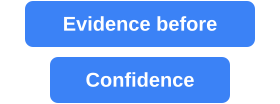
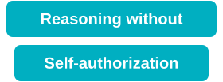
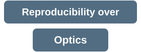
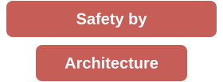

# Ƴunior Ƥortal

<!--
This README uses authored SVG/PNG presentation assets under assets/profile-badges.
The hero source selection is intentional: V2 is the stable compact/mobile rendering,
while V3 carries the desktop-only animation delta under review in PR #278.
-->

  

  

  
  
  

  I engineer quality systems that turn software change into attributable evidence — 
  and evidence into decision-grade confidence.

  <strong>Reason deliberately. Execute deterministically. Prove with attributable evidence.</strong>

<picture>
  <source media="(max-width: 640px)" type="image/svg+xml" srcset="assets/profile-badges/quality-engineering-automation-systems-nebula-portal-animated-v2.svg">
  <source type="image/svg+xml" srcset="assets/profile-badges/quality-engineering-automation-systems-nebula-portal-animated-v3.svg">
  
</picture>

---

  
  &nbsp;&nbsp;&nbsp;&nbsp;&nbsp;&nbsp;&nbsp;&nbsp;
  

<table>
<tr>
<td width="34%"></td>
<td>Evidence should precede confidence. Assertions earn trust only when their supporting observations are attributable, reproducible, and sufficiently conclusive for the decision being made.</td>
</tr>
<tr>
<td></td>
<td>Reasoning can propose, prioritize, and interpret. Authority to mutate state, waive controls, or declare success remains explicit, bounded, and independently verifiable.</td>
</tr>
<tr>
<td></td>
<td>Abstractions must preserve provenance. A failure should remain traceable to the subject, evidence, execution boundary, and oracle that produced the conclusion.</td>
</tr>
<tr>
<td></td>
<td>Every oracle has a scope and a blind spot. Quality systems should make both explicit rather than allowing a convenient green signal to imply more than was actually proven.</td>
</tr>
<tr>
<td></td>
<td>Prefer deterministic setup, controlled data, observable state transitions, and repeatable evidence over demonstrations that merely look convincing once.</td>
</tr>
<tr>
<td></td>
<td>Safety belongs in the system boundary: least privilege, explicit mutation authority, reversible operations, bounded execution, and fail-closed validation.</td>
</tr>
</table>

  

  
  
  
  
  
  

  

  
  
  
  
  
  
  
  
  
  

  Architecture and automation across AI · Web · API · GraphQL · Mobile · Performance · Accessibility · CI/CD — designed for reproducibility, attribution, and evidence-backed decisions.

> Quality engineering is the discipline of reducing uncertainty about change. I design systems that collect evidence at the narrowest conclusive layer, separate reasoning from authority, and preserve the limits of every oracle. A green state should explain exactly what was proven, by which evidence, against which subject, and under which execution boundary.

#### It is earned when evidence is traceable, oracles are explicit, and failure is attributable.
