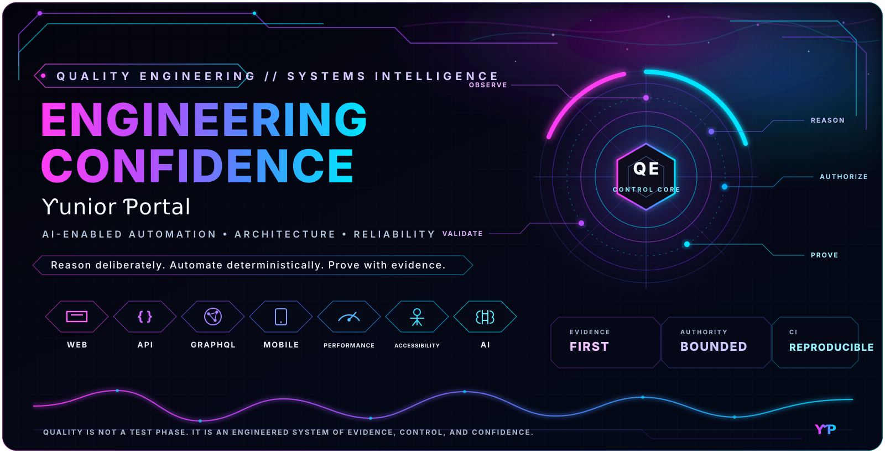
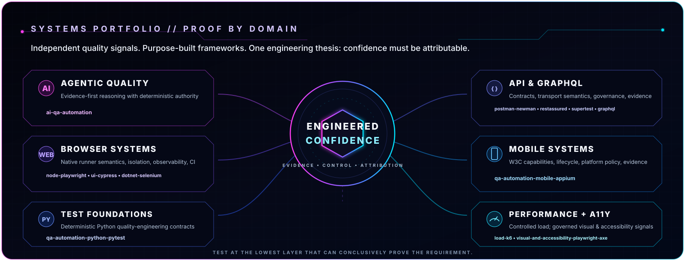
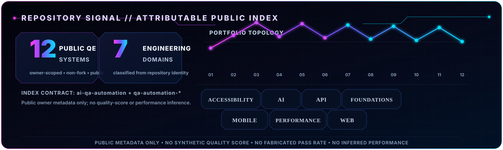

 

**I engineer quality systems that turn software change into attributable evidence — and attributable evidence into decision-grade confidence.**

Architecture and automation across **AI · Web · API · GraphQL · Mobile · Performance · Accessibility · CI/CD** — designed for reproducibility, attribution, and evidence-backed decisions.

---

## Engineering thesis

Quality engineering is the discipline of **reducing uncertainty about change**. I design systems that collect evidence at the narrowest conclusive layer, separate reasoning from authority, and preserve the limits of every oracle. A green state should explain exactly **what was proven, by which evidence, against which subject, and under which execution boundary**.

**Reason deliberately. Execute deterministically. Prove with attributable evidence.**

| Principle | Engineering contract |
| --- | --- |
| **Evidence before confidence** | A conclusion should be traceable to the exact subject, revision, environment, execution, oracle, and artifacts that support it. |
| **Reasoning without self-authorization** | AI may interpret, diagnose, rank risk, and propose; deterministic policy and validation retain authority over side effects and terminal truth. |
| **Attribution before abstraction** | Keep failure domains separable so a broken schema, resolver, transport, browser state, device session, threshold, baseline, dependency, or environment produces the right signal. |
| **Oracle discipline** | Every oracle has a scope and a limit. A green visual diff, accessibility scan, contract check, or CI job may claim only what its evidence can actually establish. |
| **Reproducibility over theater** | CI should qualify explicit runtime, dependency, target, security, and evidence contracts—not manufacture a persuasive green badge. |
| **Safety by architecture** | Mutation, external integration, sustained load, secrets, and other high-impact capabilities belong behind explicit ownership, authorization, budgets, and fail-closed boundaries. |

 

## Systems portfolio

| Quality system | Representative repositories | What the system is designed to prove |
| --- | --- | --- |
| **Agentic Quality Engineering** | [`ai-qa-automation`](https://github.com/portyu9/ai-qa-automation) | AI-assisted planning and diagnosis inside deterministic authority: controlled tools produce provenance-bound evidence, while subject-bound validation owns terminal truth. |
| **Browser Quality Systems** | [`node-playwright`](https://github.com/portyu9/qa-automation-node-playwright) · [`ui-cypress`](https://github.com/portyu9/qa-automation-ui-cypress) · [`dotnet-selenium`](https://github.com/portyu9/qa-automation-dotnet-selenium) | Runner-native browser semantics, deterministic target ownership, synchronization, isolation, lifecycle, diagnostics, evidence capture, and cross-browser qualification. |
| **API & Contract Engineering** | [`graphql`](https://github.com/portyu9/qa-automation-graphql) · [`java-restassured`](https://github.com/portyu9/qa-automation-java-restassured) · [`node-supertest`](https://github.com/portyu9/qa-automation-node-supertest) · [`api-postman-newman`](https://github.com/portyu9/qa-automation-api-postman-newman) | Protocol, schema, transport, operation governance, consumer contracts, persistence, stateful workflows, and error boundaries kept independently attributable. |
| **Mobile Quality Systems** | [`mobile-appium`](https://github.com/portyu9/qa-automation-mobile-appium) | W3C/Appium capability policy, platform-specific session lifecycle, deterministic harness qualification, explicit device boundaries, and failure evidence. |
| **Performance Quality Engineering** | [`load-k6`](https://github.com/portyu9/qa-automation-load-k6) | Authorized workload experiments with explicit demand models, target identity, threshold policy, business metrics, generator boundaries, and zero-traffic safety verification. |
| **Visual & Accessibility Quality** | [`visual-and-accessibility-playwright-axe`](https://github.com/portyu9/qa-automation-visual-and-accessibility-playwright-axe) | Governed visual baselines, semantic accessibility rules, keyboard behavior, cross-browser signals, and explicit limits on what automated oracles can claim. |
| **Python Test Foundations** | [`python-pytest`](https://github.com/portyu9/qa-automation-python-pytest) | pytest-orchestrated unit, API, contract, persistence, browser, security, and performance verification with failure attribution before test volume. |

## Engineering surface

**Automation:** Playwright · Cypress · Selenium · pytest · REST Assured · Supertest · Postman/Newman · Appium · WebdriverIO · k6 · axe-core  
**Languages & runtimes:** Python · TypeScript · JavaScript · Java · C#/.NET · Node.js  
**Delivery & assurance:** GitHub Actions · Docker · API/contract testing · visual regression · accessibility · performance · security controls · evidence-driven CI  
**Architecture focus:** deterministic execution · bounded authority · explicit oracles · observability · provenance · failure attribution · reproducibility · safe automation

 

The repository signal is generated from public GitHub owner metadata matching <code>ai-qa-automation</code> and <code>qa-automation-*</code>. It counts portfolio systems and engineering domains only; it deliberately does not infer a quality score, pass rate, coverage level, or performance result from repository metadata.

---

### Confidence is not produced by automation volume.  
### It is earned when evidence is traceable, oracles are explicit, and failure is attributable.

Ƴunior Ƥortal · Quality Engineering · Automation Architecture · AI-Enabled Quality Systems

