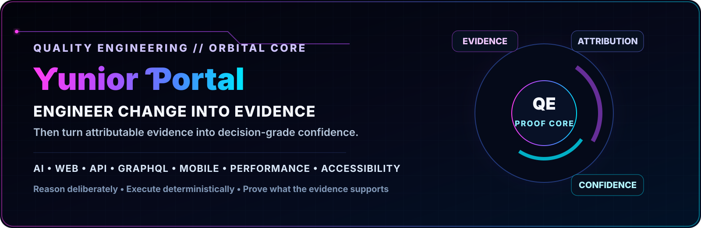
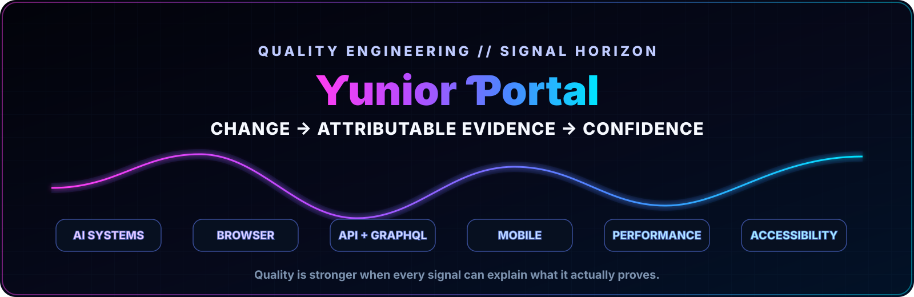
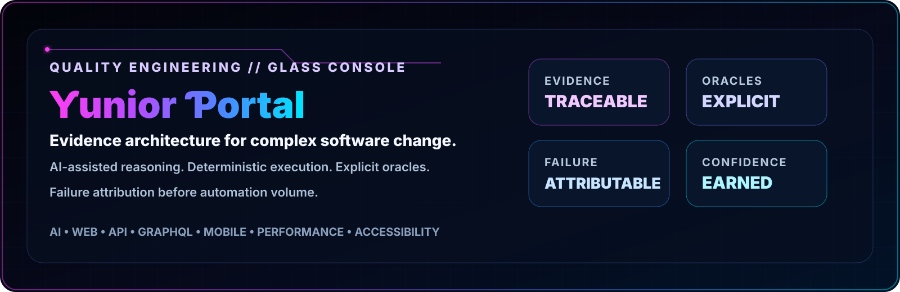
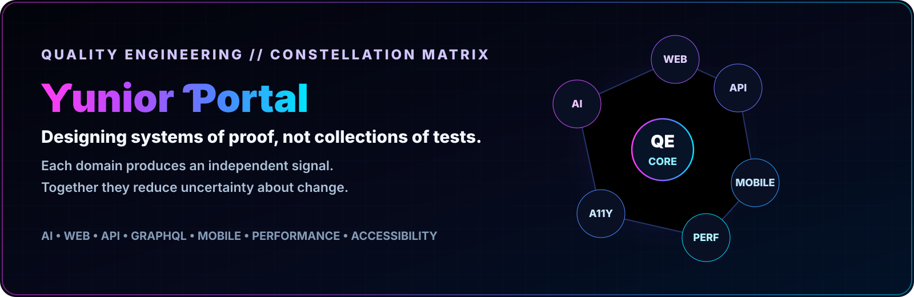
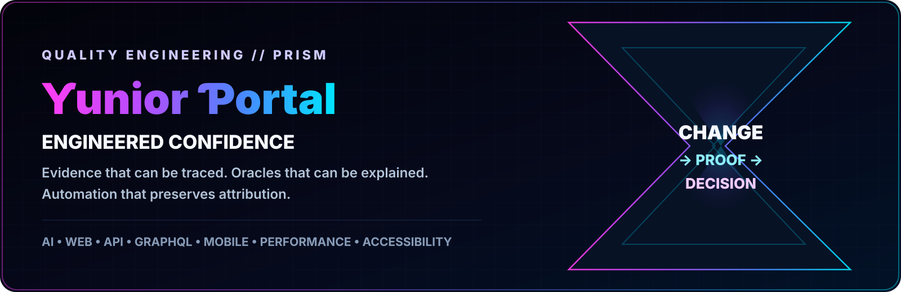
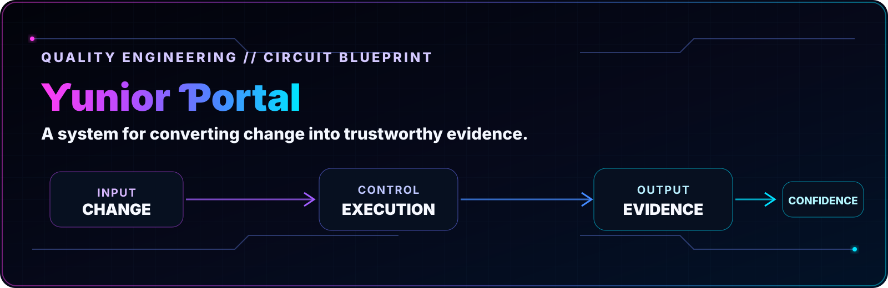

# Profile SVG Concepts — Review Set

This pull request is a **design review only**. It does not add an SVG to the live profile README.

All six concepts are authored as complete compositions at **1600 × 520** (`40:13`) with the same proportional `viewBox`. Text, containers, geometry, and visual hierarchy were designed together at the final canvas size; no concept depends on post-hoc text enlargement or patching.

## Shared contract

- Pure SVG/vector primitives only
- No PNG/JPEG/WebP/GIF assets
- No embedded `<image>`, `<script>`, or `<foreignObject>`
- No third-party widget or public profile template
- Same magenta → violet → electric-blue → cyan visual identity
- Minimum effective SVG text size: 18 px
- Explicit `preserveAspectRatio="xMidYMid meet"`
- Large safe zones around text to tolerate normal system-font differences
- The live `README.md` remains unchanged until one direction is selected

---

## Option 1 — Orbital Core

**Design language:** cinematic engineering command center with one dominant proof reactor.

**Best qualities:** strongest continuity with the existing neon/HUD brand; clear left-to-right hierarchy; visually premium without becoming a dashboard full of questionable metrics.

**Core metaphor:** evidence, attribution, and confidence orbit a central Quality Engineering proof core.

---

## Option 2 — Signal Horizon

**Design language:** wide signal waveform, symmetrical typography, domain modules.

**Best qualities:** excellent at GitHub profile width; highly legible; energetic without being visually dense.

**Core metaphor:** independent engineering signals converge into attributable confidence.

---

## Option 3 — Glass Console

**Design language:** restrained glassmorphism control console with four large doctrine panels.

**Best qualities:** executive/architectural; strongest balance between modern visual design and readable technical positioning.

**Core metaphor:** traceable evidence + explicit oracles + attributable failure = earned confidence.

---

## Option 4 — Constellation Matrix

**Design language:** network topology / systems constellation.

**Best qualities:** communicates breadth without an icon wall; distinctive architecture-oriented identity; strong fit for a multi-domain QE portfolio.

**Core metaphor:** each Quality Engineering domain is an independent proof signal connected to a common confidence core.

---

## Option 5 — Prism Minimal

**Design language:** minimal futuristic prism, large typography, very low visual noise.

**Best qualities:** most premium/minimal direction; strongest small-screen readability; least likely to feel like a generic GitHub profile widget.

**Core metaphor:** software change is transformed through proof into a defensible engineering decision.

---

## Option 6 — Circuit Blueprint

**Design language:** technical blueprint / deterministic pipeline.

**Best qualities:** clearest engineering-story visualization; very easy to scan; emphasizes architecture over decoration.

**Core metaphor:** change → controlled execution → evidence → confidence.

---

## Third-party vs. custom

These six are **fully custom**. Third-party SVG/profile services are optional, not required. Services such as metrics/stats generators can be useful for live public data, but their visual language is recognizable and limits uniqueness. A custom SVG can be original, version-controlled, testable, and still become data-driven later if a selected design needs live GitHub metadata.

The workflow after selection should be:

1. Choose one concept.
2. Refine that single composition as one integrated SVG.
3. Render-review it at full size and GitHub-width scale.
4. Open a separate implementation PR that places only the approved SVG in the live profile.
